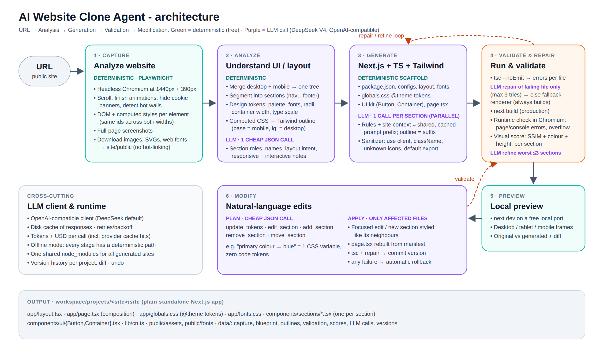

# AI Website Clone Agent

Give it a public website URL. The agent analyzes the page in a real browser, works out the layout and design system, and generates a new **responsive Next.js + TypeScript + Tailwind CSS** frontend that recreates it. It then type-checks, builds and runs the result, scores it against the original, and serves a local preview. After that you can change the site with plain-English prompts ("make the navbar sticky").

The output is new code built from reusable components. It is not an embed or a copy of the original HTML.



---

## Setup

**You need:** Python 3.10+, Node.js 20.9+ (with npm), and about 1 GB of free disk space.

```bash
git clone <this-repo> website-clone-agent && cd website-clone-agent
python -m venv .venv
source .venv/bin/activate            # Windows: .venv\Scripts\activate
pip install -r requirements.txt
playwright install chromium          # headless browser used for capture + validation
cp .env.example .env                 # then put your DeepSeek key in LLM_API_KEY
```

**Run the control panel** (recommended for the demo):

```bash
streamlit run app.py                 # opens http://localhost:8501
```

The first clone installs a shared Next.js runtime into `workspace/`. This takes 30-60 s and happens only once. Later sites reuse it.

**Or use the CLI:**

```bash
python cli.py clone https://example.com                          # clone + keep preview running
python cli.py modify example-com "Change the primary color to blue" --diff
python cli.py undo example-com
python cli.py preview example-com                               # restart a preview
python cli.py eval https://site-a.com https://site-b.com https://site-c.com   # multi-site test table
python cli.py list
python cli.py models deepseek                                    # model ids your API key can use
```

Every generated site is a normal, standalone Next.js app in `workspace/projects/<site>/site`. You can run it with `npm install && npm run dev`.

**Offline mode:** without an API key, the agent still works end to end. Sections come from the deterministic renderer, and simple edits work (theme colours, sticky navbar, removing sections). This is how the test suite runs.

---

## Architecture

| Stage | What happens | LLM? |
|---|---|---|
| **1. Capture** (`agent/capture/`) | Headless Chromium opens the URL at **1440 px and 390 px**. It scrolls to trigger lazy content, finishes animations, hides cookie banners and detects bot walls. An in-page script (`extract.js`) records every visible element's computed styles, geometry and ordered children. Both widths use the same element ids. It also takes full-page screenshots and downloads images, inline SVGs and `@font-face` files into `site/public`. | No |
| **2. Analyze** (`agent/analysis/`) | Merges the desktop and mobile captures into one **responsive tree** and splits it into sections (header, content blocks, footer; tall blocks are split, table rows stay valid). Derives **design tokens**: palette roles, font stacks, radii, container width and type scale. Translates computed CSS into **Tailwind classes**: base classes for mobile, `lg:` classes for desktop. Then **one cheap JSON call** asks the LLM for each section's role, a component name, the layout intent, responsive behaviour and interactivity. | 1 call |
| **3. Generate** (`agent/generation/`) | Writes a deterministic scaffold: package.json, configs, layout, fonts, `@theme` tokens in `globals.css`, `Button`/`Container` UI kit, and `page.tsx` built from a manifest. Then makes **one LLM call per section, in parallel**. The rules and site context form a shared prompt prefix that DeepSeek caches, and the section's reference markup is the suffix. A sanitizer fixes common LLM mistakes before anything is compiled. | 1 per section |
| **4. Validate & repair** (`agent/validation/`) | `tsc --noEmit` → errors grouped per file → **LLM repair of only the failing file**, given the exact compiler messages (up to 3 tries) → if that fails, the **deterministic fallback renderer** takes over. Then `next build`, a **runtime check** in Chromium (page and console errors, hydration errors, horizontal overflow on mobile), and a **visual score** per page and per section. The ≤3 worst-scoring sections get one targeted **refine** call that includes the measured differences. | Only on errors / refine |
| **5. Preview** | `next dev` runs on a free local port. The UI shows it in desktop, tablet and mobile frames, next to an original / generated / pixel-diff strip. | No |
| **6. Modify** (`agent/modification/`) | A cheap **plan** call turns the instruction into operations: `update_tokens`, `edit_section`, `add_section`, `remove_section` or `move_section`. Only the affected files are sent to the LLM. Then type-check + repair, and a new **version** is committed. Any failure **rolls back** automatically. Diff and undo are included. | 1 plan + 1 per touched file |

**Reference markup**: this is what the LLM receives for each section. The classes are measured, not guessed:

```html
<header class="bg-surface border-b border-border">
 <div class="flex flex-row justify-between items-center px-6 max-w-site min-h-[72px] lg:mx-auto lg:w-full">
  <a class="text-[#7c3f12] text-[22px] font-bold" href="#">Brewly</a>
  <nav class="hidden lg:flex lg:gap-7">…</nav>
  <button class="… lg:hidden" aria-label="Open menu" type="button">☰</button>
```

Repeated siblings (cards, logos, list items) are compressed to "2 examples + JSON of the rest", so large sections stay within the token budget.

---

## Technologies & models

- **Agent:** Python 3.11, Playwright (Chromium), Streamlit (control panel), OpenAI Python SDK (used as a generic OpenAI-compatible client), Pillow + NumPy (SSIM visual scoring), pytest.
- **Generated sites:** Next.js 16.3 (App Router, Turbopack), React 19, TypeScript 5.9 (`strict`), Tailwind CSS 4.3 (CSS-first `@theme` tokens), lucide-react icons.
- **Models:** **DeepSeek V4** through its OpenAI-compatible API (`https://api.deepseek.com`). The default is `deepseek-flash` (V4.1 Flash) in non-thinking mode, for speed and cost. `LLM_MODEL_FAST` routes the cheap steps (analysis, planning, repairs) to a separate model, and `LLM_MODEL=deepseek-v4-pro` switches generation to the larger model. Any OpenAI-compatible endpoint (OpenRouter, a local server) works by changing `LLM_BASE_URL` / `LLM_MODEL`. Analysis also sends a down-scaled screenshot (`LLM_VISION=true`, default; V4.1 Flash is multimodal) and retries text-only if a model rejects images.

---

## Key implementation decisions

1. **Measure deterministically, let the LLM structure.** The browser already knows the exact font sizes, spacing, colours and grid tracks, so asking an LLM to guess them from pixels is slower, costlier and less accurate. The agent converts computed styles to Tailwind in code. The LLM's job is what code can't do well: naming, componentization (typed arrays + `.map()`), semantics, and interactivity such as the mobile menu.
2. **Responsive from two real captures.** Elements carry the same id at 1440 px and 390 px, so the agent knows which elements appear, disappear or change layout. That is where the `hidden lg:flex`, `grid-cols-1 lg:grid-cols-3` and working hamburger menus come from.
3. **One component per section, generated in parallel.** Outputs stay small, errors stay isolated (one bad section never breaks the site), there are no whole-site truncations, and the shared prompt prefix is cached.
4. **Everything that doesn't need an LLM is a template.** Configs, layout, fonts, the UI kit and page composition are generated in code, which removes the most common build breakers. Page composition comes from a manifest, so adding, removing or moving a section can't break `page.tsx`.
5. **Theme as CSS variables.** Tokens live in `app/globals.css` (`--color-primary`, `--font-heading`, `--radius-button`), and exact matches are mapped to classes like `bg-primary`. So "change the primary color to blue" is a one-variable edit that costs no code tokens.
6. **A validation ladder that always ends green.** Sanitizer → tsc → targeted LLM repair → deterministic fallback → production build → browser runtime check → visual score → bounded refine. The same fallback renderer powers offline mode.
7. **Shared Node runtime.** A single `node_modules` in `workspace/` serves every generated site, so a new clone starts in seconds and disk use stays flat. Each site's own `package.json` still lists its dependencies, so the site stays a standalone project.

## Cost awareness

- Deterministic stages (capture, tokens, Tailwind translation, scaffold, page, assets, fonts, sanitizing, token edits) cost nothing.
- **Compressed prompts:** invisible nodes are pruned, trivial wrappers collapsed, inherited styles emitted only when they change, and repeated siblings compressed.
- **Prompt-prefix caching:** the first section is generated alone to warm DeepSeek's cache, then the rest run in parallel and pay the cached input rate for the shared prefix.
- **Local response cache** (`workspace/cache/llm`): identical calls are never paid for twice (re-runs and demos are free).
- **Targeted calls only:** repairs send one file plus its errors; edits send only the touched files; refine is capped at 3 sections; retries are budgeted.
- **Model routing and non-thinking mode** for the cheap steps.
- **Every call is metered**: input, cached and output tokens and USD are shown in the UI (*Validation & cost* tab) and stored in `data/llm_calls.json`.

Rough budget for a 10-section page with `deepseek-flash`: about 100k input and 50k output tokens, which is **a few US cents per site** (about half that off-peak). A typical edit costs a fraction of a cent. The UI shows the real numbers.

## Error handling

| Failure | Handling |
|---|---|
| Invalid URL, DNS error, timeout, HTTP errors | Clear message; a partial render continues when possible |
| Bot protection / captcha page | Detected by title/text; the agent stops with an explanation |
| Endless network activity, lazy content, animations | Idle timeout, scrolling, `getAnimations().finish()`, CSS motion off |
| LLM rate limits / 5xx / timeouts | Exponential backoff (4 attempts); unsupported params dropped and retried |
| Bad JSON from the model | Tolerant parser, then one "fix your JSON" re-ask; heuristic fallback |
| No code / truncated code | Fence extraction; the section falls back to deterministic TSX |
| TypeScript / build errors | Mapped to files → LLM repair with compiler output (×3) → fallback → placeholder |
| Runtime / hydration errors | Mapped to a section by component stack or dev-server log → repair or fallback |
| Broken modification | Type-check + repair; otherwise **automatic rollback** to the last version |
| Node/npm missing or too old | Checked up front with an actionable message |

## Testing

```bash
pytest tests/test_unit.py            # fast, deterministic logic
pytest tests/test_llm_client.py      # real LLM client vs. a fake OpenAI-compatible server (retries, cost, cache)
pytest tests/test_e2e.py             # ~1-2 min, needs Node + Chromium; no internet or API key
```

The end-to-end tests clone a local multi-section fixture site twice:

- **Offline:** checks structure, sections, preview, a visual score above 70, colour and sticky-navbar edits, and undo.
- **With a scripted stand-in for the LLM that makes realistic mistakes:** a missing `"use client"`, `class=`, a non-existent icon, a type error, and a reply with no code. The test checks that each mistake gets sanitized, repaired or replaced by the fallback, and that a four-operation edit (tokens + edit + add + remove) applies correctly.

For multiple real websites, `python cli.py eval <url1> <url2> <url3>` prints a table with build status, section sources (LLM vs fallback), desktop/mobile similarity, time and cost.

## Limitations

- Only the given page is recreated. Links to other pages of the site become `#`; external links are kept.
- Rich interactions (carousels, tabs, dropdown menus, scroll animations) are recreated as their static state. Only simple interactivity (for example the mobile menu) is implemented.
- `<canvas>`/WebGL becomes a screenshot, videos keep their remote source, and only YouTube/Vimeo/Maps iframes are embedded.
- Sites behind logins or bot protection can't be captured. Very heavy SPAs may render partially.
- Images and fonts are downloaded for the local preview only. They belong to the original site owners.
- Very large sections are truncated in the prompt (`MAX_SECTION_CHARS`), so their tail may be simplified.
- The visual score (SSIM + colour + height) is a heuristic signal, not a perceptual guarantee.
- The Streamlit UI runs a clone synchronously, so avoid clicking around while a run is in progress.
- Developed and tested on Linux. Windows and macOS are handled (paths, process groups) but less tested.

## Project structure

```
app.py                     Streamlit control panel
cli.py                     CLI: clone / modify / undo / preview / eval / list
agent/
  config.py  llm.py  prompts.py  pipeline.py  project.py  events.py
  capture/     browser.py (Playwright)  extract.js (in-page)  dom.py (tree + sections)  assets.py
  analysis/    stylemap.py (CSS→Tailwind)  tokens.py  outline.py  blueprint.py (LLM analysis)
  generation/  scaffold.py  sections.py (LLM codegen)  codefix.py (sanitizer)  fallback.py  templates/
  validation/  runtime.py (Node, tsc, build, dev servers)  repair.py  checks.py (browser)  visual.py
  modification/ modify.py (plan → apply → validate → commit/rollback)  history.py (versions, diff, undo)
tests/                     unit + end-to-end (fixture site, scripted LLM)
docs/                      architecture diagram, demo script, technical notes
```
